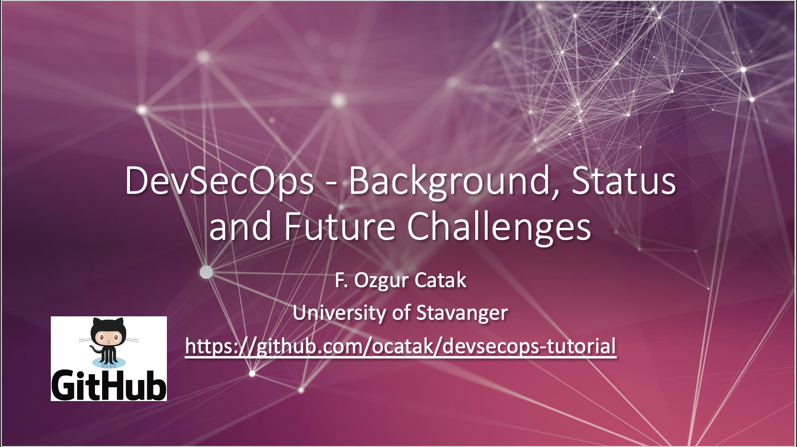

# DevSecOps - Background, Status and Future Challenges

 - F. Ozgur Catak - f.ozgur.catak@gmail.com 
 - [Powerpoint Presentation](https://github.com/ocatak/devsecops-tutorial/raw/master/DevSecOps.pdf)
 - GitHub repository for the lecture at [**University of Stavanger**](https://www.uis.no/en)
 - June 14th, 2021



### Jenkins Installation
we can run Jenkins as Docker image

```console
docker pull jenkins
```

## Contributing
Pull requests are welcome. For major changes, please open an issue first to discuss what you would like to change.

Please make sure to update tests as appropriate.

## License
[MIT](https://choosealicense.com/licenses/mit/)


